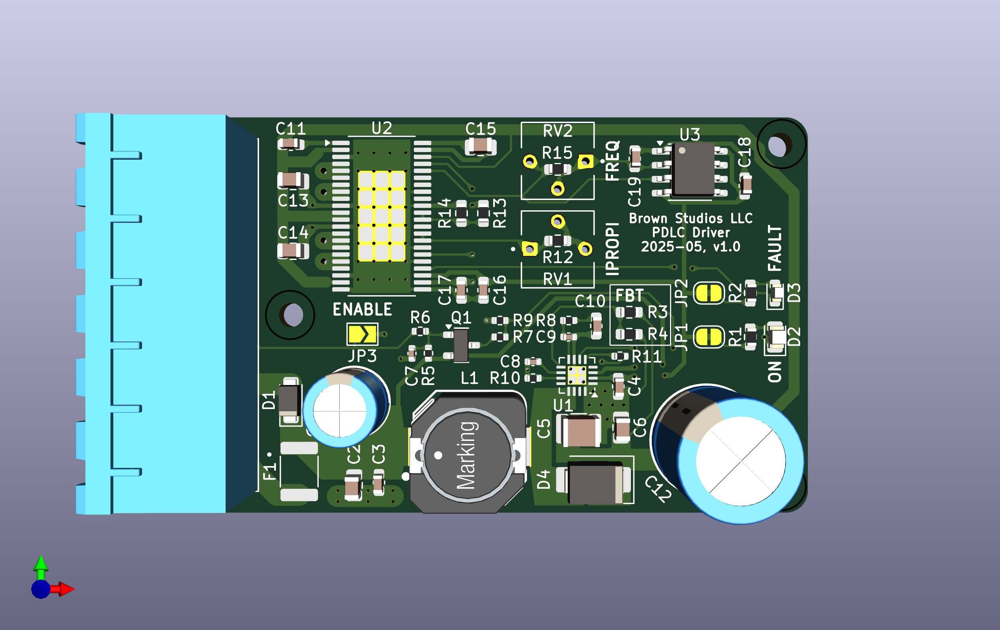
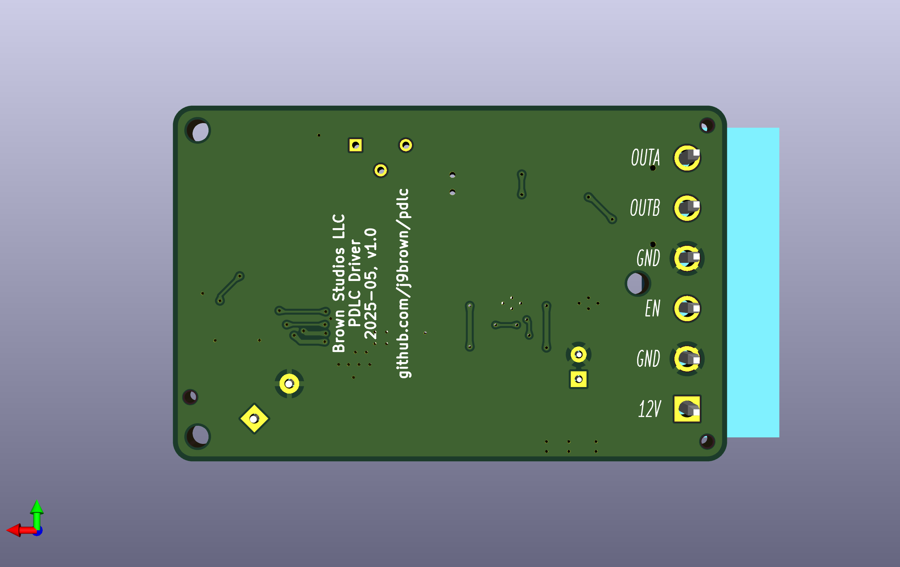

# PDLC driver

**Status: UNDER DEVELOPMENT**

Drives [polymer dispersed liquid crystal (PDLC) film](https://en.wikipedia.org/wiki/Smart_glass#Polymer-dispersed_liquid-crystal_devices) from a 12 V DC nominal power supply.

PDLC film is opaque when turned off and becomes clear when turned on.  For example, you can apply it to a window to replace a privacy curtain or to create a diffuse surface for a projection screen on demand.

## Features

Here are some of the features of this PDLC driver board:

- Supports approximately 4 square meters of PDLC film depending on its electrical characteristics
- Outputs ~60 V AC with up to 18 W of power from a 10 to 16 VDC power supply
- Can use a switch, relay, optocoupler, or transistor to remotely enable the driver
- Includes built-in circuit protection for the supply and load
- Power on indicator

## Design synopsis

The driver has the following major components:

- A [LM5158](https://www.ti.com/lit/ds/symlink/lm5158.pdf) boost converter produces ~60 V DC at 300 mA (actually 61 V DC) with overload, over voltage, and over temperature protection
- A [LM5108](https://www.ti.com/lit/ds/symlink/lm5108.pdf) half-bridge driver and discrete FETs produce the AC square wave output
- A [TLC555](http://www.ti.com/lit/ds/symlink/tlc555.pdf) timer and [SN74LVC1G14](https://www.ti.com/lit/ds/symlink/sn74lvc1g14.pdf) inverter generate square waves for commutation at 100 Hz
- Supply circuit protection with a 2 A polyfuse and transient voltage suppressor
- Remote enable / shutdown circuit with under voltage lock-out

[View the schematics in PDF format](hardware/pdlc.pdf)

## Circuit board

## Installation

Wire the 6-pin connector according to the labels shown on the back side of the circuit board as follows.  We recommend using crimped wire ferrules to secure stranded wires before screwing them into the terminal block.

Make sure the supply is turned off while making these connections.

Connect `12V` and one `GND` terminal to a 10 to 16 V DC supply using 20 AWG (0.5 mm^2) wire or larger.  Pay attention to the polarity: `12V` is positive and `GND` is negative.  We recommend adding a 3 A fuse or circuit breaker to protect the wiring to the device.

Connect `OUTA` and `OUTB` to the PDLC film using 22 AWG (0.3 mm^2) wire or larger.  Either terminal can be connected to the PDLC film in either orientation because the film uses AC and there is no distinct polarity.  These wires carry enough voltage to deliver a small electric shock that could be harmful to people so please ensure that the wires are adequately insulated and not exposed to touch.

Connect `EN` to one `GND` terminal via a switch circuit, via a short jumper wire, or by soldering the `ENABLE` jumper closed.  The `EN` terminal is active low so the driver turns on when `EN` is grounded and turn offs otherwise.  Use 24 AWG (0.2 mm^2) wire or larger to make the connection.  Smaller wires will work but may be too fragile for the terminals.

The switch circuit carries less than 1 mA of current at 12 V DC nominal.  You can use many kinds of switching devices to close the circuit from `EN` to `GND` such as a simple SPST rocker switch, a relay, an optocoupler, or a transistor.

If you would like to disable the power on indicator, cut the `JP1` jumper trace.

## Usage

After [installing the PDLC driver](#installation), provide power to the driver and activate the switch circuit.

If everything is working as intended, the PDLC film will become clear and the power on indicator labeled `ON` will glow red (unless it has been disabled).

If this does not happen, disconnect power then recheck your connections and the [recommended operational parameters](#recommended-operational-parameters-and-circuit-protection).

## Recommended operational parameters and circuit protection

Supply:

- Voltage: 12 V DC nominal and absolute maximum range from 10 to 16 V DC
- Wiring: minimum 20 AWG (0.5 mm²)
- Circuit protection
  - Internal: built-in 2 A polyfuse, transient voltage suppressor, reverse polarity protection, and under voltage lock-out below 9 V
  - External: add a 3 A fuse or circuit breaker to protect the wiring to the device

Load:

- Voltage: ~60 V AC square wave at 100 Hz
- Current: 300 mA maximum continous load
- Power output: 18 W maximum continuous load
- Circuit protection
  - Internal: built-in overload, over voltage, and over temperature protection
  - External: ensure wires are adequately insulated and not exposed to touch

In case of an overload such as exceeding the maximum output current or a short circuit, the power supply will hiccup until the overload condition is removed.

Please test your set up carefully if you choose to operate the PDLC driver beyond these recommendations.

## PDLC film electrical characteristics

Here is some general information about the electrical characteristics of PDLC films for which this driver was design.  If your PDLC film has significantly different electrical characteristics, please follow the tuning instructions or contact the author for advice on using this driver with your film.

The film's capacitance is proportional to its surface area, around 10 uF per square meter.  It becomes clear when charged and opaque when discharged.

The film's resistance is inversely proportional to its surface area, generally in the tens to hundreds of kiloohms.  It self-discharges rapidly and becomes opaque when power is removed.

The film's clarity increases with voltage.  It is opaque at 0 V, begins to clear around 20 to 30 V, is nearly transparent around 50 V, and becomes slightly clearer with increasing voltage.

The film must be driven with AC to produce an alternating electric field to orient the liquid crystals and it may be damaged when driven in one polarity for too long.  At very low frequencies, the film acts as a shutter.  As the frequency rises to a few hertz, the film will appear to pulse between opaque and clear states.  At higher frequencies, the film appears clear.  Mains AC frequencies (50 / 60 Hz) seem adequate.

### Modifying the drive parameters

**Caution: Modifying the driver's output voltage or frequency may damage the driver or the film!  We recommend testing your changes with a small sample of the material and a current limited bench power supply.**

To change the output frequency, remove the surface mount resistor within the block labeled `FREQ` (if there is one), then solder in a surface mount resistor of a different value or a potentiometer.  Ensure that the `FREQ` resistor value generates a frequency of at least a few hertz to prevent damage to the film.

To change the output voltage, remove the surface mount resistor labeled `FBT`, then solder in a surface mount resistor of a different value.

Refer to the [schematics](hardware/pdlc.pdf) for the formulas, footprints, and default component values.

### Data

Here's some information about PDLC films that the driver has been tested with.  

- FilmBase PDLC self-adhesive grey film
  - Operating voltage: 60 V AC (manufacturer recommendation)
  - Frequency: 50/60 Hz (manufacturer recommendation)
  - Power: < 5W / m^2 (manufacturer claim)
  - Capacitance: ~12 uF / m^2 (measured)

## Notice

The PDLC driver software, documentation, design, and all copyright protected artifacts are released under the terms of the [MIT license](LICENSE).

The PDLC driver hardware is released under the terms of the [CERN-OHL-W license](hardware/LICENSE).
