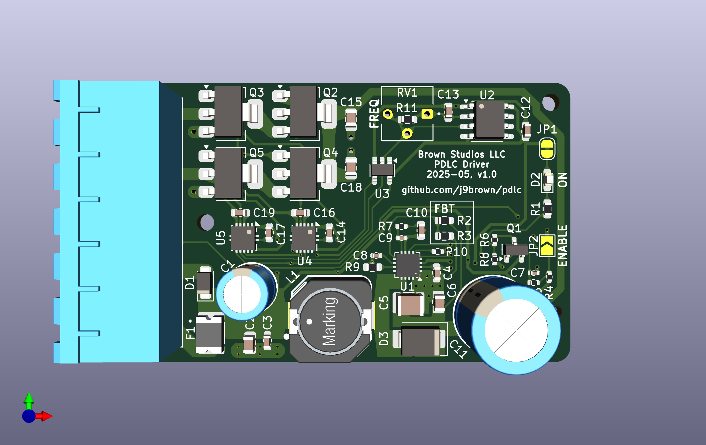

# PDLC driver

Drives [PDLC](https://en.wikipedia.org/wiki/Smart_glass#Polymer-dispersed_liquid-crystal_devices) privacy film from a 12 V DC nominal power supply for use in automotive applications.

## Features

PDLC film is opaque when turned off and becomes clear when turned on.  You can use it to replace a current in a campervan, for example.

Here are some of the features of the this PDLC driver board:

- Supports approximately 4 square meters of PDLC film depending on its electrical characteristics
- Outputs ~60 V AC with up to 18 W of power from a 10 to 16 VDC power supply
- Can use a switch, relay, optocoupler, or transistor to remotely enable the driver
- Includes built-in circuit protection for the supply and load

## Design

**Status: UNDER DEVELOPMENT**

The driver has the following major components:

- [LM5158](https://www.ti.com/lit/ds/symlink/lm5158.pdf) boost converter produces ~60 V DC at 300 mA (actually 61 V DC)
- [DRV8262](https://www.ti.com/lit/ds/symlink/drv8262.pdf) motor driver produces the AC square wave output with a 2.5 A current limit
- 555 timer generate square waves for commutation at 100 Hz
- 2 A resettable polyfuse, transient voltage suppression, and reverse polarity protection for the input supply

[View the schematics in PDF format](hardware/pdlc.pdf)

View the circuit board

## Installation

Wire the 6-pin connector according to the labels shown on the back side of the circuit board as follows.  We recommend using crimped wire ferrules to secure stranded wires before screwing them into the terminal block.

Connect `12V` and one `GND` terminal to a 10 to 16 V DC supply using 20 AWG (0.5 mm^2) wire or larger.  Pay attention to the polarity: `12V` is positive and `GND` is negative.  We recommend using a 3 A fuse to protect the wiring.  Make sure the supply is turned off while making these connections.

Connect `OUTA` and `OUTB` to the PDLC film using 22 AWG (0.3 mm^2) wire or larger.  Either terminal can be connected to the PDLC film in either orientation because the film uses AC so there is no specific polarity.  These wires carry enough voltage to deliver a small electric shock to humans that could be harmful so please ensure they are adequately insulated and not exposed.

Connect `EN` to one `GND` terminal via a switch circuit, via a short jumper wire, or by soldering the `ENABLE` jumper closed.  The `EN` terminal is active low so driver turns on when `EN` is grounded and turn offs otherwise.  Use 24 AWG (0.2 mm^2) wire or larger to make the connection.  Smaller wires will work but may be too fragile for the terminals.

The switch circuit carries less than 1 mA of current.  You can use many kinds of switching devices to close the circuit from `EN` to `GND` such as a simple SPST rocker switch, a relay, an optocoupler, or a transistor.

## Recommended operational parameters

Supply:

- Voltage: 12 V DC nominal and absolute maximum range from 10 to 16 V DC
- Wiring: minimum 20 AWG (0.5 mm²)
- Circuit protection
  - Internal: built-in 2 A polyfuse, transient voltage suppression, and reverse polarity protection
  - External: 3 A fuse or circuit breaker recommended to protect the wires

Load:

- Voltage: ~60 V AC square wave at 100 Hz
- Current: 300 mA continuous, 2.5 A instantaneous (current limited)
- Power output: 18 W continuous
- Circuit protection
  - Internal: built-in short circuit, over current, and over temperature protection
  - External: none required

Please test your set up carefully if you choose to push the PDLC driver beyond these recommendations.

## PDLC film electrical characteristics

Here's some general information about the electrical characteristics of PDLC films.  If your PDLC film has significantly different characteristics, please follow the tuning instructions or contact the author for advice on using this driver with your film.

The film's capacitance is proportional to its surface area, around 10 uF per square meter.  It becomes clear when charged and opaque when discharged.

The film's resistance is inversely proportional to its surface area, generally in the tens to hundreds of kiloohms.  It self-discharges rapidly and becomes opaque when power is removed.

The film's clarity increases exponentially with voltage.  It is opaque at 0 V, begins to clear around 20 to 30 V, becomes nearly transparent around 50 V, and incrementally clearer with increasing voltage.

The film must be driven with AC to produce an alternating electric field.  It will be damaged when driven with DC.  At very low frequencies, the film acts as a shutter.  As the frequency rises to a few hertz, the film will appear to pulse between opaque and clear states.  At higher frequencies, the film appears clear.  Mains AC frequencies (50 / 60 Hz) seem adequate.

### Modifying the drive parameters

**Caution: Modifying the driver's output voltage, frequency, and current limit may damage the film or your circuit board!  We recommend testing your changes on a small sample of the material and a current limited bench power supply.**

To change the output frequency, remove the surface mount resistor within the block labeled `FREQ`, if there is one, then solder in a surface mount resistor of a different value or a potentiometer.  Ensure that the `FREQ` resistor value generates a frequency of at least a few hertz to prevent damage to the film.

To change the output current limit, remove the surface mount resistor within the block labeled `IPROPI`, if there is one, then solder in a surface mount resistor of a different value or a potentiometer.

To change the output voltage, remove the surface mount resistor labeled `FBT`, then solder in a surface mount resistor of a different value.

Refer to the [schematics](hardware/pdlc.pdf) for the formulas, footprints, and default component values.

### Data

Here's some information about films that the driver has been tested with.  

- FilmBase PDLC self-adhesive grey film
  - Operating voltage: 60 V AC (manufacturer recommendation)
  - Frequency: 50/60 Hz (manufacturer recommendation)
  - Power: < 5W / m^2 (manufacturer claim)
  - Capacitance: ~12 uF / m^2 (measured)

## Notice

The PDLC driver software, documentation, design, and all copyright protected artifacts are released under the terms of the [MIT license](LICENSE).

The PDLC driver hardware is released under the terms of the [CERN-OHL-W license](hardware/LICENSE).
